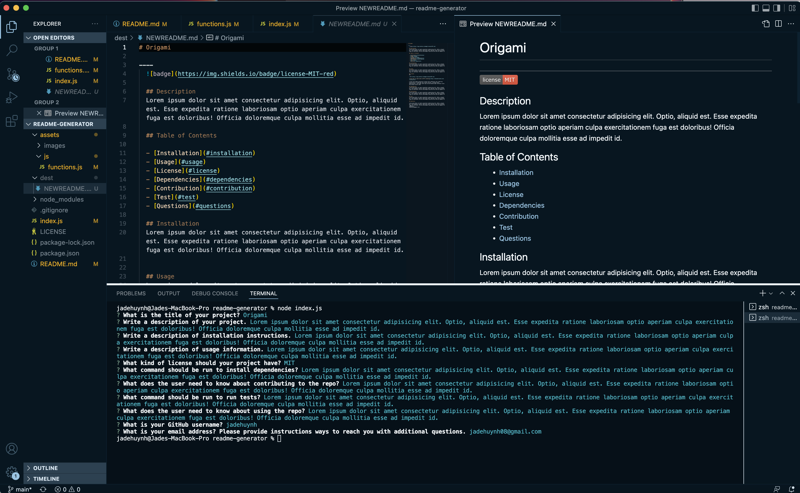
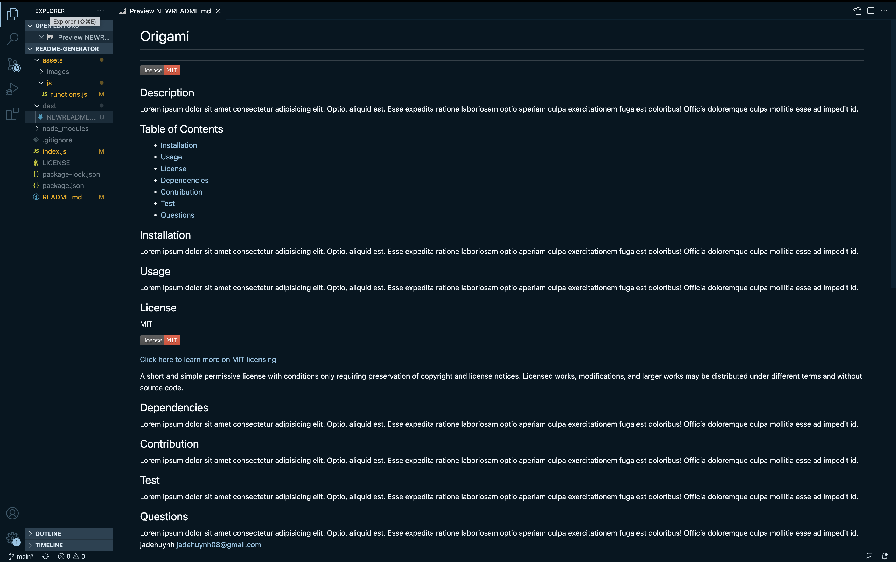

# README.md-Generator
----

## Welcome to the README.md Generator!
---
#### Easily generate your own README markdown document to help guide and direct users through your application!

## Instructions:

    * Open readme-generator in VS Code
    * Select the 'index.js' file
    * Right click and open the file in 'Intergrated Terminal'
    * Enter the command 'npm init -y' to get the package.json file
    * Next, enter the command 'npm i inquirer' to install 'inquirer' package
    * Once package is installed, run the command 'node index.js'
    * Begin to answer prompts thoroughly
    * Once questions have been answered, the 'NEWREADME.md' file will generate under the 'dest' folder
    * Click Preview README to see your file

[Link to live video tutorial](https://youtu.be/waOGqcoQljI)

[GitHub Repository Link](https://github.com/jadehuynh/readme-generator)

####
----
# Images
## Going through Prompts in Intergrated Terminal

## Preview of finished README.md
